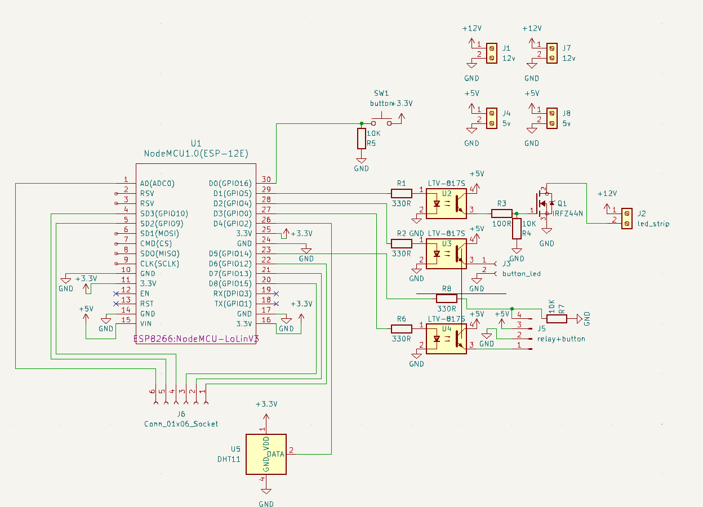
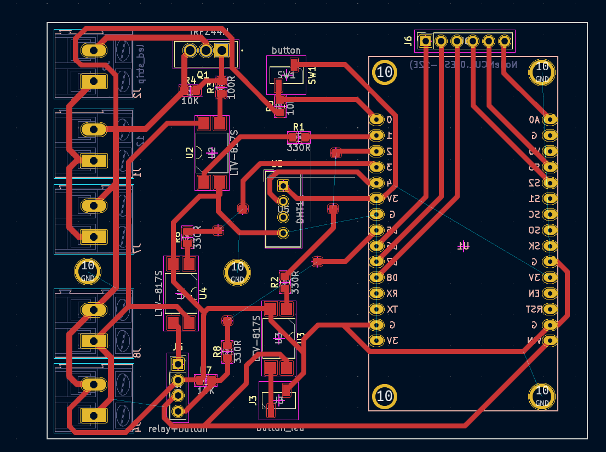
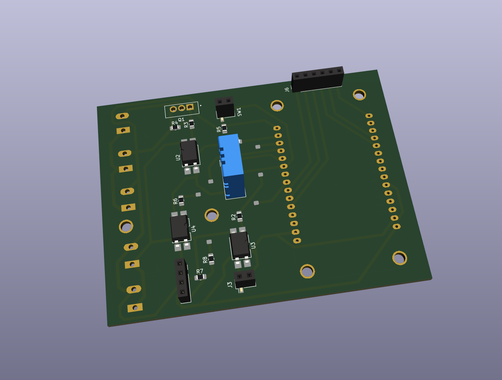

# led_strip_controller_with_yandex_home
Контролер с возможностью подключения к умному дому Яндекс


Идея проекта сделать основу для проектов умного дома с интеграцией в умный дом Яндекс. Изначально возникла потребность управлять светодиодной лентой с возможностью димирования, но представленные контроллеры не внушали доверия

### Компоненты
- esp8266 для управления
- оптопары для управления транзисторами и другой нагрузкой 5 вольт
- транзистор IRF44N для управления светодиодной ленты
- кнопка без фиксации с подсветкой
- блок питания 12 вольт (расчитанный по мощности под ленту)
- понижающий dc-dc преобразователь для питания платы и компонентов

## Печатная плата
Печатная плата спроектирована в KiCad, исходники можно посмотреть в `kitchen_light_pcb/`, а библиотеки компенонтов использованные лежат в `kicad_lib`


Схема печатной платы

- Разъем J2 для подключения светодиодной ленты
- J1, J7 разьемы 12 вольт на вход
- J4, J8 разьемы 5 вольт на вход
- J6 разьем подключенный к ESP, для подключения чего либо если понадобится
- есть датчик температуры и влажности DHT22
- J5 задумывается для использования реле и кнопки, чтобы встроить в выключатель без нуля
- SW1 контакты для кнопки, в моем случае это внешняя кнопка, крепится в низ шкафа над плитой
- J3 контакты для подсветки кнопки


Разведение печатной платы


Печатная плата в 3D


Печатная плата в жизни, сделанная по методу ЛУТ

## Код
Файл с кодом: `controller_code/controller_code.ino`  
В коде необходимо прописать параметры под ваши условия:
``` cpp
#define ssid  "" //write your SSID
#define password  "" //write password
#define mqtt_server "" //url or ip mqtt server
#define mqtt_port 1883 //port for mqtt server
```
Тут необходимо указать данные вашего WIFI и MQTT сервера  
Как вариант найти MQTT сервер можно [тут.](https://mntolia.com/10-free-public-private-mqtt-brokers-for-testing-prototyping/)

Также надо прописать топики для управления лентой, они должны быть уникальными, особенно при использовании публичного сервера, так как кто нибудь может туда публиковать значения
```cpp
#define LAMP_STATE_TOPIC "kitchen/lamp/state" //поменять на свои
#define LAMP_POWER_TOPIC "kitchen/lamp/power"
```

Прошивать надо через Arduino IDE, гайд [тут.](https://wiki.iarduino.ru/page/wemos_start/)

### Подключение к Алисе
Интеграция в умный дом происходит через навык "Домовёнок Кузя", у автора есть подробные гайды на [сайте](https://alexstar.ru/smarthome) и на [Ютуб](https://www.youtube.com/watch?v=lm6nl2dc3VI&t=30s)

Необходимо будет зайти под своим аккаунтом Яндекс, настроить правила MQTT на включение, выключение и изменения яркости, а также создать виртуальное устройство к которому привязать правила MQTT

## Результат работы
<video controls>
  <source src="pics/video.mov" type="video/mp4">
</video>

